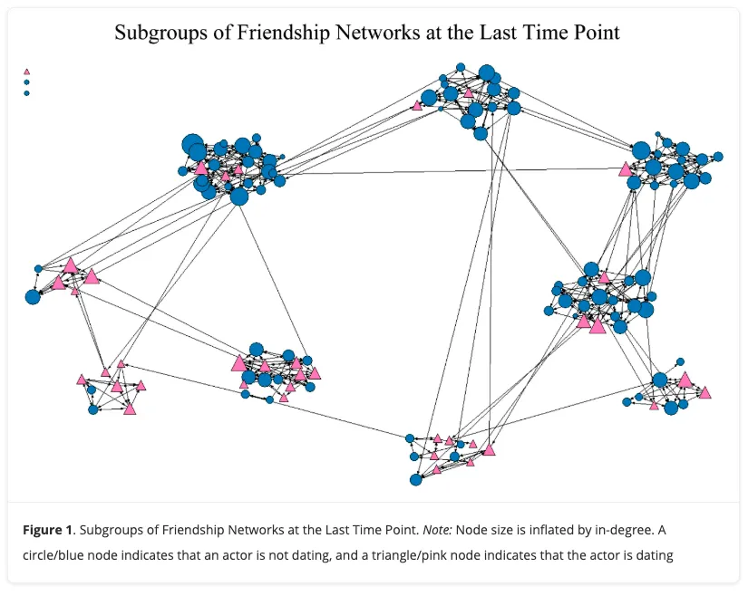

# 💕 Romance Matters: Adolescent Friendship Network Analysis

> *Understanding how dating relationships shape the formation and dissolution of teenage friendships*

[](https://doi.org/10.1177/02654075231222446)
[](https://www.r-project.org/)
[](LICENSE)
[](https://github.com/SociologYoung/Romance-matters)

---

## 🎯 Overview

This repository contains comprehensive R scripts for analyzing **adolescent friendship networks** across three time points, with a particular focus on understanding how **romantic relationships influence friendship dynamics**. The analysis employs advanced statistical modeling techniques including STERGMs (Separable Temporal Exponential Random Graph Models) to uncover the complex interplay between dating and friendship formation/dissolution.

### 🔬 Research Question
*How do romantic relationships affect the beginnings and endings of adolescent friendships?*


---

## ✨ Key Features

- 📊 **Longitudinal Network Analysis** - Track friendship changes across three time points
- 💘 **Romance-Friendship Dynamics** - Examine how dating influences social connections  
- 🔄 **Missing Data Handling** - Robust imputation methods for incomplete attribute data
- 📈 **Advanced Modeling** - STERGM implementation for temporal network analysis
- 🎨 **Network Visualization** - Beautiful, publication-ready network plots
- 📋 **Reproducible Research** - Complete workflow from data processing to results

---

## 🛠️ Installation & Setup

### Prerequisites
```r
# Required R version
R >= 4.0.0
```

### Install Required Packages
The script will automatically install missing packages, but you can also install them manually:

```r
required_packages <- c(
  "statnet",      # Network analysis suite
  "coda",         # MCMC diagnostics
  "ergm",         # Exponential random graph models
  "network",      # Network objects and methods
  "dplyr",        # Data manipulation
  "tidyr",        # Data tidying
  "readxl",       # Excel file reading
  "mice",         # Multiple imputation
  "tergm",        # Temporal ERGMs
  "ergMargins",   # ERGM marginal effects
  "stargazer",    # Results tables
  "psych",        # Psychological statistics
  "GGally"        # Network visualization
)

install.packages(required_packages)
```

---

## 📁 Data Source

This analysis uses the **Glasgow Teenage Friends and Lifestyle Study** dataset, which is publicly available and widely used in social network research.

### 🔗 **Data Access**
📊 **Download the data**: [Glasgow Teenage Friends Dataset](https://www.stats.ox.ac.uk/~snijders/siena/Glasgow_data.htm)  
*Hosted by the University of Oxford - Department of Statistics*

### 📋 **Required Files**
After downloading, you'll need these files for the analysis:

```
📂 Expected Data Files
├── 🔗 FriendshipNetwork_t1_binary.csv  # Friendship adjacency matrix (Time 1)
├── 🔗 FriendshipNetwork_t2_binary.csv  # Friendship adjacency matrix (Time 2)  
├── 🔗 FriendshipNetwork_t3_binary.csv  # Friendship adjacency matrix (Time 3)
└── 👥 attribute_AgeSexRom_analysis.csv  # Individual attributes & romantic status
```

### 📊 **Dataset Information**
- **Study**: Glasgow Teenage Friends and Lifestyle Study
- **Participants**: 133 adolescents from a Scottish secondary school
- **Time Points**: Three waves of data collection
- **Variables**: Friendship networks, demographics, romantic relationships, and lifestyle factors
- **Format**: CSV files with adjacency matrices and attribute data

### 🔄 **Data Preparation**
The R script automatically processes the downloaded data files - just ensure they're in your working directory with the expected filenames.

### 🕸️ **Sample Network Visualization**
<div align="center">
  
  <br>
  <em><strong>Figure 1:</strong> Subgroups of Friendship Networks at the Last Time Point</em>
  <br>
  <small>Blue circles = Non-dating adolescents | Pink triangles = Dating adolescents<br>
  Node size reflects in-degree (popularity in friendship nominations)</small>
</div>

*This visualization shows the type of network analysis possible with the Glasgow dataset using our analytical approach.*

---

## 🚀 Quick Start

1. **Clone the repository**
```bash
git clone https://github.com/SociologYoung/Romance-matters.git
cd Romance-matters
```

2. **Download the Glasgow dataset**
   - Visit: https://www.stats.ox.ac.uk/~snijders/siena/Glasgow_data.htm
   - Download the required friendship network and attribute files
   - Place them in your project directory

3. **Set up your workspace**
```r
# Update the working directory path in the script
setwd("path/to/your/Romance-matters/folder")
```

4. **Run the analysis**
```r
source("RomanceMatters.R")
```

---

## 🎨 Network Visualizations

Our analysis reveals fascinating patterns in adolescent friendship networks:

<div align="center">
  
</div>

### Key Visual Insights:
- 🔵 **Blue circles**: Non-dating adolescents
- 🔺 **Pink triangles**: Dating adolescents  
- 📏 **Node size**: Proportional to in-degree (friendship popularity)
- 🌐 **Network structure**: Clear subgroup formations with bridging connections

The network visualization demonstrates how romantic status influences social positioning, with dating adolescents often serving as bridges between different friendship clusters.

---


## 📊 Analysis Pipeline

### 1. 📥 Data Loading & Preprocessing
- Load friendship networks for three time points
- Process individual attribute data
- Handle missing values using multiple imputation (MICE)

### 2. 🕸️ Network Construction  
- Convert adjacency matrices to network objects
- Assign individual attributes to network vertices
- Calculate friendship formation and dissolution rates

### 3. 📈 Dynamic Analysis
- **Friendship Formation**: New ties between time points
- **Friendship Dissolution**: Lost ties between time points  
- **Stability Patterns**: Persistent relationships over time

### 4. 🎨 Visualization
- Network plots colored by gender
- Temporal comparison across three waves
- Publication-ready graphics using GGally

### 5. 🔬 Statistical Modeling
- **STERGM Models**: Separable Temporal Exponential Random Graph Models
- **Formation Effects**: Factors promoting new friendships
- **Dissolution Effects**: Factors leading to friendship endings
- **Romantic Relationship Impact**: Key predictor of interest

---

## 📋 Key Findings

> **Main Result**: Romantic relationships significantly influence adolescent friendship dynamics, affecting both the formation of new friendships and the dissolution of existing ones.

### Network Statistics
- Track changes in network density over time
- Measure reciprocity and transitivity patterns  
- Analyze gender homophily effects
- Quantify romantic relationship clustering

---

## 🎓 Academic Impact

### Publication
**Zhang, H., & Felmlee, D. (2024).** Romance matters: The role of dating in adolescents' friendship beginnings and endings. *Journal of Social and Personal Relationships*, 41(6), 1623-1639.

[](https://doi.org/10.1177/02654075231222446)

### Citation
```bibtex
@article{zhang2024romance,
  title={Romance matters: The role of dating in adolescents' friendship beginnings and endings},
  author={Zhang, Haowen and Felmlee, Diane},
  journal={Journal of Social and Personal Relationships},
  volume={41},
  number={6},
  pages={1623--1639},
  year={2024},
  publisher={SAGE Publications},
  doi={10.1177/02654075231222446}
}
```

---

## 🤝 Contributing

We welcome contributions! Please feel free to:

- 🐛 Report bugs or issues
- 💡 Suggest new features or analyses  
- 📚 Improve documentation
- 🔄 Submit pull requests

---

## 📜 License

This project is licensed under the MIT License - see the [LICENSE](LICENSE) file for details.

---

## 👥 Authors & Contact

- **Haoyang Zhang** - *PhD candidate in Sociology and Social Data Analytics*  
  [](https://scholar.google.com/citations?user=IrT5TIYAAAAJ&hl=en)
  
- **Diane Felmlee** - *Distinguished Professor of Sociology and Demography*  
  [](https://scholar.google.com/citations?user=-231VJMAAAAJ&hl=en)

📧 For questions about the code or research, please open an issue or contact the authors at **hzz5179@psu.edu**

---

## 🙏 Acknowledgments

- **Glasgow Teenage Friends and Lifestyle Study** - Original data collection team & For making the data publicly available
- Social network analysis community for methodological foundations
- R development team and package maintainers

---

<div align="center">

**⭐ If this code helps your research, please give us a star and cite our paper! ⭐**

[🔗 Repository](https://github.com/SociologYoung/Romance-matters) • [📄 Paper](https://doi.org/10.1177/02654075231222446) • [👨‍💻 Author](https://github.com/SociologYoung)

</div>